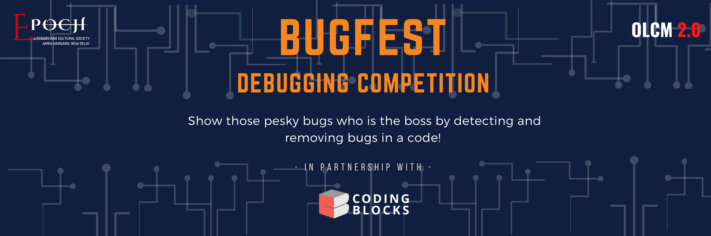

  <h1 align="center"> 🐞 BUGFEST </h1>

 

  <h4 align="center">  Show those pesky bugs who is the boss by detecting and removing bugs in a code!✨ </h4>

    

  <h2 align="center"> 🤔 ABOUT </h2>

#### BugFest is a student-run event/contest, organized by Epoch literary and cultural society,Jamia Hamdard.

- [Epoch'](http://epochsociety.in/): Epoch is a student-run literary and cultural society of jamia hamdard, Delhi.which opens plethora of opportunities.
In collaboration with-
- [CodingBlocks](https://codingblocks.com/): Coding Blocks was founded in 2014 with a mission to create skilled Software Engineers for our country and the world. We are here to bridge the gap between the quality of skills demanded by industry and the quality of skills imparted by conventional institutes. At Coding Blocks, we strive to increase student interest by providing hands on practical training on every concept taught in the classroom.

> **"If debugging is the process of removing bugs, then programming must be the process of putting them in."**

  <h2 align="center"> 🏗 STRUCTURE:-</h2>
 Only one hour is alotted for this whole event so make sure you find the bugs in time .
 Submission can be done by uploading your debugged code at any platform eg. GitHub, GitLab, BitBucket,Drive etc. and submitting the link to the event organizers through google forms.
 
 

  <h1 align="center"> ⚡ PARTICIPATION GUIDELINES</h1>

Rules and regulations help hackers understand what is expected of them & make sure to follow the [instructions](https://github.com/ghulamyazdani/BugFest/blob/master/participation-guidelines.md) without violating them.

  <h2 align="center"> 📰 CODE OF CONDUCT </h2>

Every participant is requested to abide by the [Code of Conduct](https://github.com/ghulamyazdani/BugFest/blob/master/CODE_OF_CONDUCT.md). Failure to do so will result in immediate disqualification.

 

  <h2 align="center">👕 PERKS & GIVEAWAYS </h2>

 

All divisions will be judge simultaneously. Top 3 Hackers will be awarded as below:

 

    

| **POSITION** | **SWAGS** |
| :---:         | :---:           |
| Everyone  | **Certificate of Appreciation** |
| Rank 3rd     | **Certificate for stand 3rd** |
| Rank 2nd     | **Stickers' pack** & Certificate for stand 2nd |
| Rank 1ST     | **T-Shirt** & Certificate for 1st position |

 

<!-- 

  <h2 align="center"> 🏆 DEBUG CHAMPS </h2>

 

    

 -->
